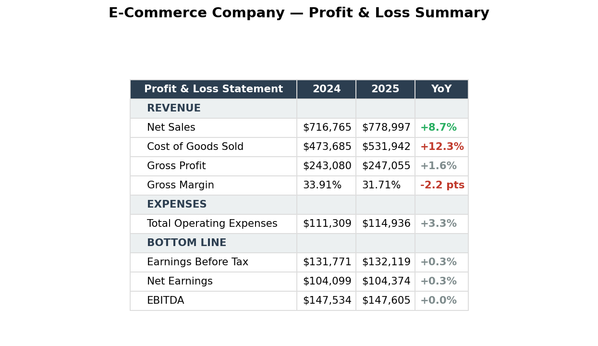
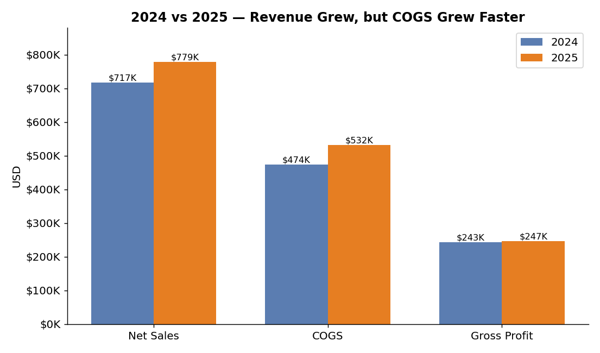
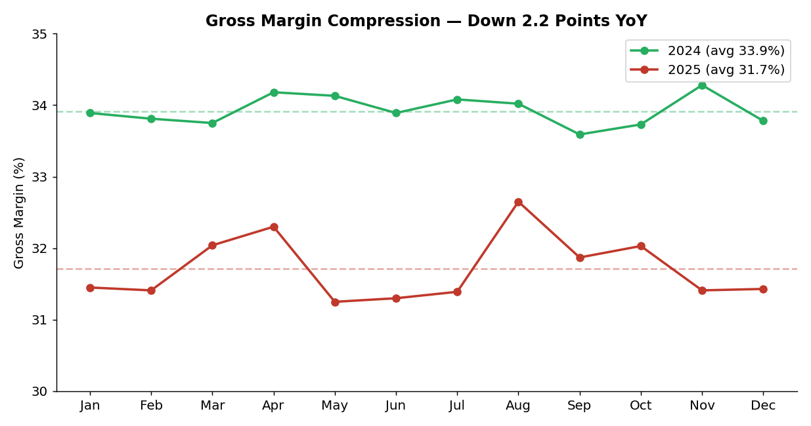
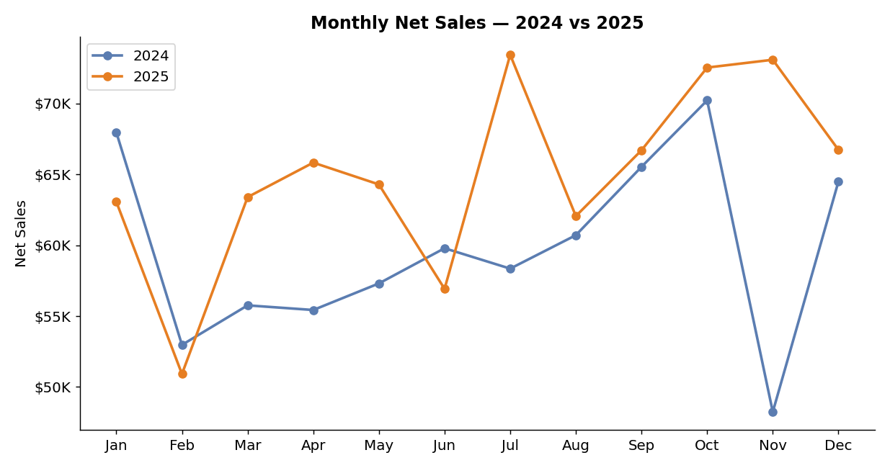

# 📊 E-Commerce Profit Analysis & Dashboard

> **Financial analysis of an e-commerce company's 2024 vs. 2025 performance — profitability trends, product-level drivers, and 2026 forecast scenarios — built in Google Sheets.**


---

## 🖼️ Dashboard Preview

**Profit & Loss summary** — the headline numbers at a glance.



**2024 vs 2025 performance** — revenue grew, but COGS grew faster, squeezing gross profit.



**Gross margin compression** — margin fell from 33.9% to 31.7% across the year.



**Monthly net sales** — 2025 (orange) outpaced 2024 (blue) in most months.



🔗 **Live dashboard:** [Open in Google Sheets](https://docs.google.com/spreadsheets/d/1ixEdL6VuHNfs8jvB1Jm7tuNE5rcbA5XBrFcH0yedeoI/edit?usp=sharing)
📄 **Executive summary:** [presentation.pdf](presentation.pdf)

---

## 📌 Project Overview

This project analyzes profitability trends for an e-commerce company, comparing 2024 and 2025 performance, identifying which products drove growth, and forecasting three 2026 scenarios.

*Completed during the Udacity Data Analyst Nanodegree.*

---

## 🎯 Business Questions

- How did profitability change from 2024 → 2025?
- Which products contributed most to growth, and which dragged on it?
- Did revenue growth actually translate into higher profit?
- What trends compressed margins?
- What actions could improve 2026 profitability?

---

## 📈 Key Findings

### Financial Performance (2024 → 2025)

| Metric | 2024 | 2025 | Change |
| ------ | ---- | ---- | ------ |
| Net Sales | $716,765 | $778,997 | **+8.7%** |
| Cost of Goods Sold | $473,685 | $531,942 | **+12.3%** |
| Gross Profit | $243,080 | $247,055 | **+1.6%** |
| Gross Margin | 33.91% | 31.71% | **−2.2 pts** |

> **Insight:** Revenue grew, but COGS grew faster — so profitability efficiency weakened even as the top line expanded.

> **Bottom line:** Despite an **8.7% jump in Net Sales, Net Earnings were essentially flat** ($104,099 → $104,374, **+0.3%**). Growth did not reach the bottom line — rising cost of goods and operating expenses absorbed nearly all of the additional revenue. The business grew sales without growing profit.

### Product-Level Insights

- **Product 1** delivered the strongest year-over-year improvement.
- **Product 2** saw declining profitability and needs review.
- **Product 3** held the highest volume performance.

### 2026 Forecast Scenarios

| Scenario | Projected Profit |
| -------- | ---------------- |
| Best case | ≈ $201,825 |
| Base case | ≈ $158,811 |
| Worst case | ≈ $117,864 |

---

## 🚀 Business Recommendations

- Improve gross-margin efficiency by controlling COGS growth.
- Prioritize higher-performing products; review underperformers.
- Reduce cost lines growing faster than revenue.
- Shift toward retention and ROI-driven marketing.
- Explore recurring-revenue opportunities.

**Goal:** grow profitability while keeping growth sustainable.

---

## 🛠 Skills Demonstrated

Dashboard development · financial analysis · trend analysis · business metrics · forecasting · pivot tables · data storytelling · business recommendations

---

## 📂 Repository Structure

```
ecommerce-profit-analysis-dashboard/
│
├── images/           # Dashboard screenshot(s)
├── presentation.pdf  # Executive summary & findings
├── dashboard-link.md # Link to the live Google Sheets dashboard
└── README.md
```

---

## 👤 Author

**Michael Jon-Baptiste** — Data Analyst
SQL · Python · Excel · Google Sheets · Tableau

🔗 GitHub: https://github.com/Rozaay12 · 💼 [LinkedIn](https://www.linkedin.com/in/michael-jon-baptiste-b63001170)

⭐ Building projects focused on analytics, dashboards, and business insights.
